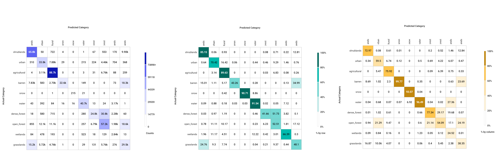
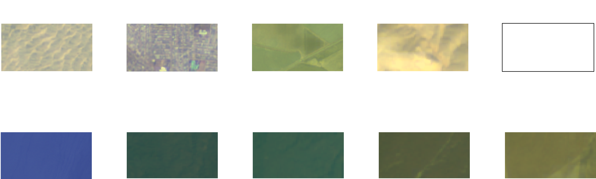

## Summary
Land cover detection using Sentinel satellite data with instance segmentation.

## How to run

### Environment setup
1. If you want to create a local environment (e.g. on AWS), please run `env/setup_env.sh`
2. If you want to create a docker container, please run `env/setup_docker.sh`)

### Training
1. Create your `yml` config file in `config` folder, according to parameters in `default.py`
2. Run training with `python train.py --cfg CONFIG_PATH`
3. Experiment can be tracket in [comet_ml](https://www.comet.ml/site/). In order to do so, please add your API_KEY in `.comet.config`

4. Weights are saved to `weights` folder
5. Logs can be found in `logs` folder

### Testing
1. In order to test and get class-wise metrics on test set, run `evaluate.py --cfg CONFIG_PATH --checkpoint WEIGHTS_PATH`

### Inference
1. In order to make inference, run `infer.py --cfg CONFIG_PATH --checkpoint WEIGHTS_PATH --sample_list PATH_TO_SAMPLES_TXT --outputs SELECTED_OUTPUTS`. Possible outputs are: alphablend (png), raster (mask with geographic coordinates), alphablended_raster (alphablend with geographic coordinates) and raw_raster (input image).

## Folders:
* config: training configs, dataset configs
* env: scripts to build docker environment
* logs: training logs
* models: models implementation
* tests: code tests
* tools: visualization tool
* train_utils: utils for training
* utils: I/O, visualization, raster utils
* weights: for weights

## Dataset
Reference:
* https://github.com/chrieke/awesome-satellite-imagery-datasets/blob/master/README.md
* https://www.isprs-ann-photogramm-remote-sens-spatial-inf-sci.net/IV-2-W7/153/2019/isprs-annals-IV-2-W7-153-2019.pdf

### Used datasets:
SEN12MS ([LINK](https://mediatum.ub.tum.de/1474000))
* Spatial resolution: 10m
* Patch size: 256 x 256
* Classes: 33 (converted to 12)
* According to the [paper](https://www.isprs-ann-photogramm-remote-sens-spatial-inf-sci.net/IV-2-W7/153/2019/isprs-annals-IV-2-W7-153-2019.pdf), the accuracy of annotation is ~80%, which is also limitation for the training.
* Channels: 12 bands of Sentinel L2C (Only RBG bands used for training and its results are shown in this document)
* Dataset for class `snow` was created by this repository creator using [EO Browser](https://apps.sentinel-hub.com/eo-browser/)

## Models
* DeepLab v3
* HRNet ([implementation](https://github.com/HRNet/HRNet-Semantic-Segmentation), [paper](https://arxiv.org/pdf/1904.04514.pdf))

## Results

### **Metrics (test set)**

| class | recall | precision  |      f1|
|-|-|-|-|
| shrublands    | 0.85 |  0.73  |0.79|
| urban         | 0.70 |  0.60  |0.65|
| agricultural  | 0.90 |  0.76  |0.82|
| barren        | 0.43 |  1.00  |0.60|
| snow          | 0.91 |  0.93  |0.92|
| water         | 0.92 |  0.97  |0.94|
| dense_forest  | 0.42 |  0.77  |0.54|
| open_forest   | 0.53 |  0.54  |0.54|
| wetlands      | 0.66 |  0.23  |0.23|
| grasslands    | 0.48 |  0.38  |0.42|

### **Confusion matrix (test set)**

### **Generated masks example**

#### Real-life Web App
The model is used in [this repository](https://github.com/mintusf/land_cover_tracking) as a backend for land cover classification.
