## Summary
Land cover detection using Sentinel satellite data with instance segmentation (WIP).

## Folders and scripts structure:
* assets: images for README
* config: training configs, dataset configs
* data_analysis: EDA notebooks
* env: scripts to build docker environment
* logs: training logs
* models: models implementation
* tests: code tests
* tools: visualization tool
* train_utils: utils for training
* utils: I/O, visualization, raster utils
* weights: for weights
* train.py: used for training
* test.py: used for evaluating test set
* infer.py: used for inference (raster or alphablend)

## Dataset
Reference:
* https://github.com/chrieke/awesome-satellite-imagery-datasets/blob/master/README.md
* https://www.isprs-ann-photogramm-remote-sens-spatial-inf-sci.net/IV-2-W7/153/2019/isprs-annals-IV-2-W7-153-2019.pdf

### Used datasets:
SEN12MS ([LINK](https://mediatum.ub.tum.de/1474000))
* Spatial resolution: 10m
* Patch size: 256 x 256
* Classes: 33 (converted to 12)
* Input channels: "B2", "B3", "B4", "B5" of Sentinel L2C

### Other datasets:
* only water: [LINK](https://www.kaggle.com/franciscoescobar/satellite-images-of-water-bodies)
* surface & cloud: [LINK](https://zenodo.org/record/4172871#.YQYu_44zZPY)
* surface (only Africa): [LINK](https://registry.mlhub.earth/10.34911/rdnt.d2ce8i/)
* only Slovenia: [LINK](http://eo-learn.sentinel-hub.com/)
* big Europe: [LINK](http://bigearth.net/#about)

## Models
* Model: DeepLab v3

## Results

### **Metrics (test set)**

| class | recall | precision  |      f1|
|-|-|-|-|
| shrublands    | 0.95 |  0.36  |0.52|
| urban         | 0.74 |  0.78  |0.76|
| agricultural  | 0.69 |  0.35  |0.46|
| barren        | 0.31 |  0.98  |0.47|
| snow          | 0.89 |  0.90  |0.89|
| water         | 0.80 |  0.97  |0.88|
| dense_forest  | 0.90 |  0.69  |0.78|
| open_forest   | 0.41 |  0.72  |0.52|
| wetlands      | 0.83 |  0.80  |0.81|
| grasslands    | 0.15 |  0.50  |0.23|

| Confusion matrix (samples counts) | Confusion matrix (% of row) | Confusion matrix (% of column) |
|-|-|-|
| 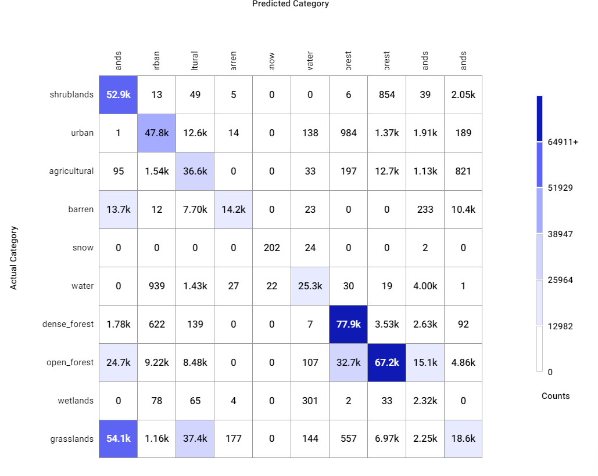 | 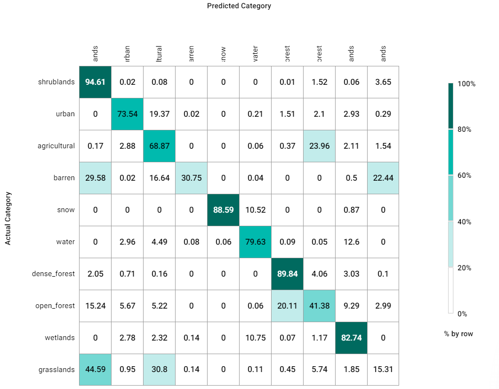 | 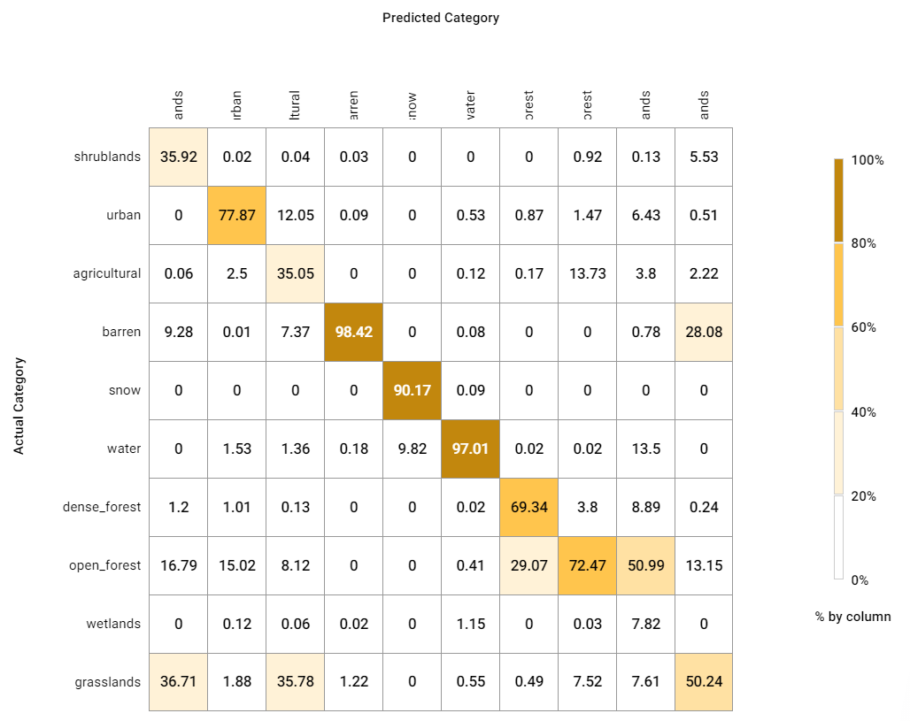 |

### **Generated masks example**

| urban | water | agriculture | wetlands | open_forest | deep_forest |
|-|-|-|-|-|-|
|  |  |  |  |  |  |

#### Test dataset

| Stree Map | Satelite image alphablended with predictions masks |
|-|-|
| 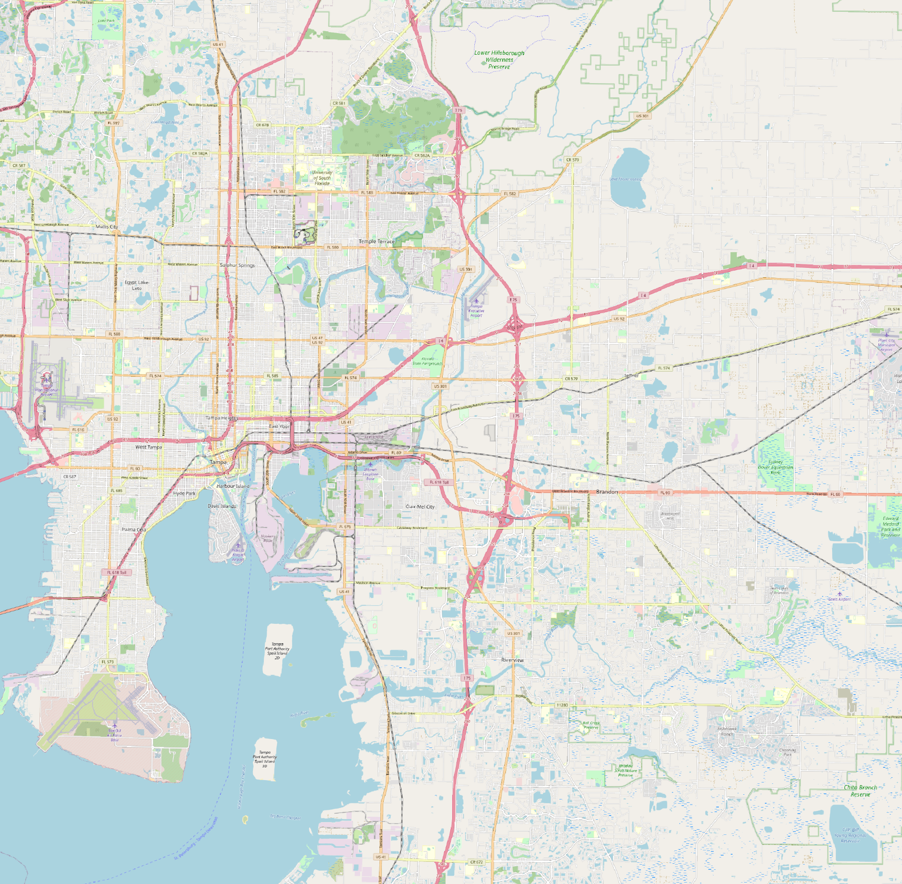 |  |
| 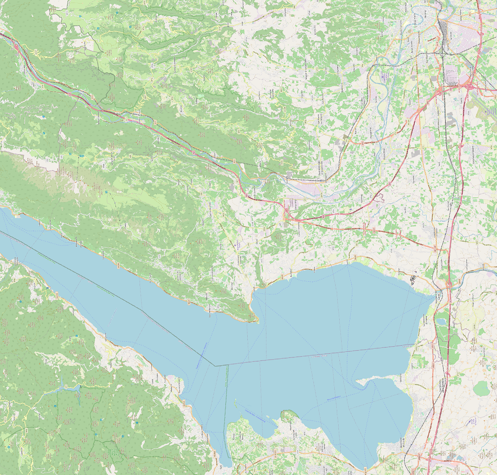 |  |
| 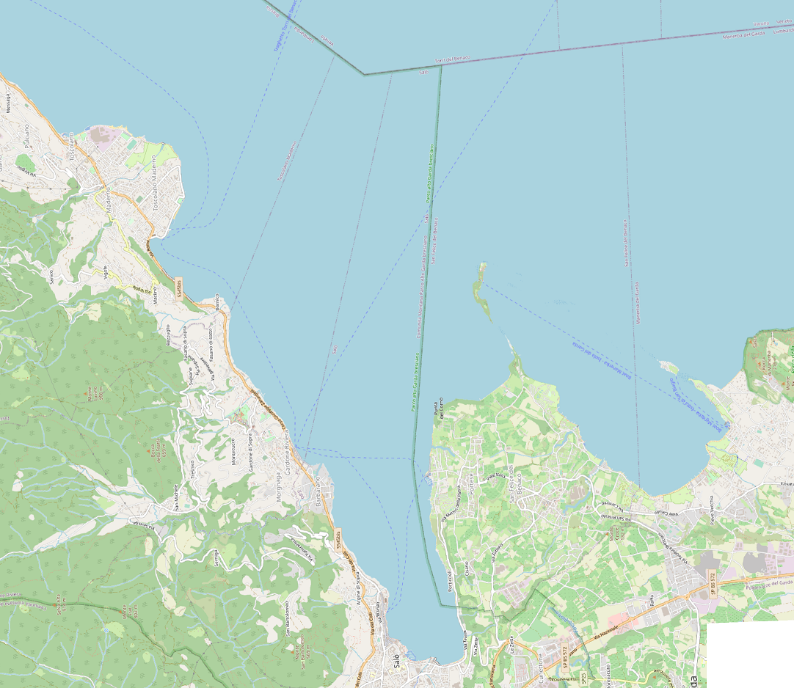 | 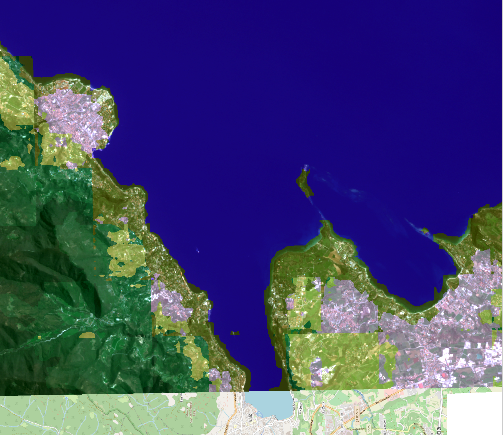 |
| 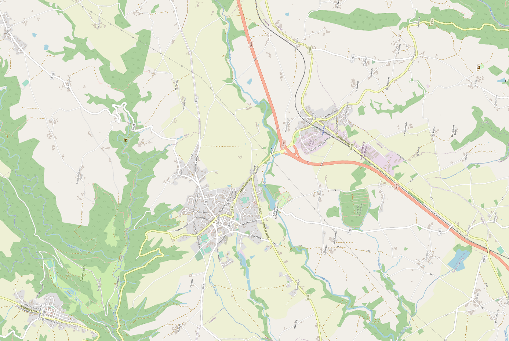 | 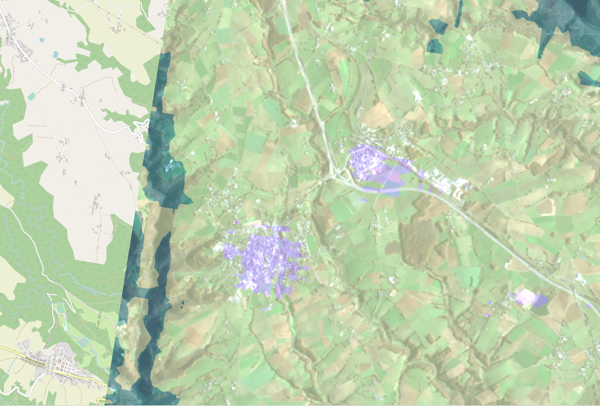 |
|  |  |
| 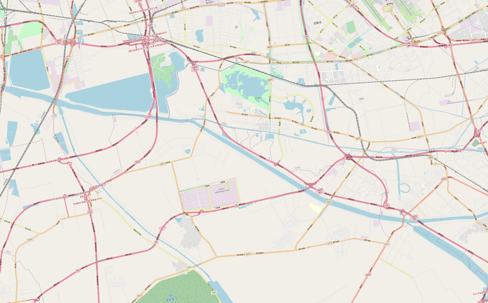 |  |
| 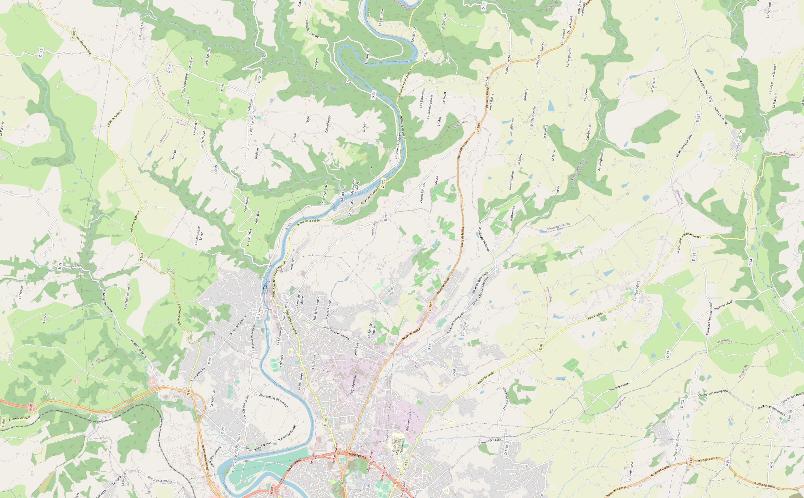 |  |

#### Real-life test (Sentinel image downloaded from EOBrowser)

